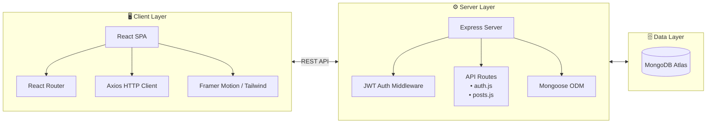

<div align="center">

# ✍️ MERN Dulan Blog

**A Full‑Stack Blogging Platform with Authentication, CRUD, and Modern UI**

[](https://www.mongodb.com/mern-stack)
[](https://reactjs.org/)
[](https://nodejs.org/)
[](https://expressjs.com/)
[](https://www.mongodb.com/cloud/atlas)
[](https://tailwindcss.com/)
[](https://jwt.io/)
[](https://vercel.com/)
[]()

*“Where ideas meet engineering – a modern, secure, and responsive blogging hub.”*

</div>

---

## 📖 Executive Summary

The **MERN Tech Blog** is a full‑stack web application that allows authenticated users to create, edit, and delete blog posts, complete with cover images. Built on the proven MERN stack (MongoDB, Express, React, Node.js), it provides a clean, responsive interface for both readers and content creators.

Key goals achieved:
- **Secure Authentication** – JWT‑based login with bcrypt password hashing.
- **Full CRUD Operations** – Create, read, update, and delete posts.
- **Rich Content** – Markdown support and cover image uploads.
- **Modern UI/UX** – Framer Motion animations and Tailwind CSS for a polished, device‑friendly design.
- **Production Deployment** – Backend on Node.js (serverless Vercel functions) and frontend on Vercel.

> 🔗 **Live Demo**: [dulanblogs.vercel.app](https://dulanblogs.vercel.app)

---

## 🏗️ System Architecture

The application follows a client‑server model with a clear separation of concerns, making it easy to maintain and scale.


---
## Data Flow:

1. A user signs up / logs in → the server returns a JWT.
2. Authenticated requests include the token in the Authorization header.
3. Express middleware validates the token before allowing access to protected routes.
4. Mongoose models handle all MongoDB operations (users, posts).
5. The React frontend consumes these endpoints and renders the UI reactively.
---

## 🚀 Key Features & Innovations

### 1. 🔐 Secure Authentication & Authorization
- JWT tokens for stateless, scalable authentication.
- bcryptjs for secure password hashing.
- Protected API routes – only authenticated users can create, edit, or delete posts.
- Initial admin user seeding via init-admin.js.

### 2. 📝 Full CRUD Blog Management

- Create posts with titles, markdown content, and cover images.
- Edit or delete only your own posts (authorization enforced on backend).
- Read‑optimised post listing and single‑post views.

### 3. 🖼️ Cover Image Integration

- Upload cover images for each blog post (stack configured for Cloudinary or local storage – ready for extension).
- Images are displayed beautifully on the homepage and post pages.

### 4. 🎨 Modern, Animating UI

- Tailwind CSS for utility‑first, responsive styling.
- Framer Motion for subtle page transitions and micro‑interactions.
- Lucide React icons for a clean, consistent icon set.
- Fully responsive – works seamlessly on desktop, tablet, and mobile.

### 5. ⚡ Performance & Deployment

- **Frontend**: Deployed on Vercel, leveraging its global CDN.
- **Backend**: Runs as serverless functions on Vercel (Express adapter).
- **Database**: MongoDB Atlas with built‑in replication and backups.
- **Environment** variables keep secrets safe and configuration environment‑aware.

---

## 🛠️ Installation & Quick Start

## Prerequisites

- Node.js (v22.x or later)
- npm or yarn
- MongoDB Atlas account (or local MongoDB instance)

## 1. Clone the Repository

```bash
git clone https://github.com/DulanDhanush/mern-tech-blog.git
cd mern-tech-blog
```

## 2. Backend Setup

```bash
cd backend
cp .env.example .env          # Create your environment file
npm install
```

Edit .env with your MongoDB URI and JWT secret:

```text
MONGO_URI=your_mongodb_atlas_uri
JWT_SECRET=your_super_secret_key
PORT=5000
```

## 3. Frontend Setup

```bash
cd ../frontend
cp .env.example .env          # Create your environment file
npm install
```

Edit .env with your backend API URL:

```text
REACT_APP_API_URL=http://localhost:5000/api
```

## 4. Run in Development

**Backend** (from /backend):
```bash
npm run dev          # Starts server with nodemon on http://localhost:5000
```

**Frontend** (from /frontend):
```bash
npm start            # Starts React dev server on http://localhost:3000
```

Open http://localhost:3000 to view the app.

## 5. Production Build & Deployment

- **Frontend**: npm run build → deploy build/ folder to Vercel.
- **Backend**: The provided Vercel configuration (vercel.json) turns Express into serverless functions simply push to a Vercel project.

---

### 📂 Repository Directory Structure

```plaintext
mern-tech-blog/
├── backend/
│   ├── models/               # Mongoose schemas (User, Post)
│   ├── routes/               # API endpoints (auth, posts)
│   ├── middleware/           # JWT authentication middleware
│   ├── server.js             # Express app entry point
│   ├── init-admin.js         # Seed initial admin user
│   ├── package.json
│   └── .env                  # Environment variables (not committed)
├── frontend/
│   ├── public/               # Static assets
│   ├── src/
│   │   ├── components/       # Reusable React components
│   │   ├── pages/            # Page-level components (Home, Login, Post, etc.)
│   │   ├── App.js            # Main app with routing
│   │   ├── index.js          # React DOM entry
│   │   └── ...               # CSS, test files, etc.
│   ├── package.json
│   └── .env                  # Environment variables (not committed)
├── .gitignore
└── README.md                 # You are here
```

---
### 🎥 Demo Video


---

### 👥 Meet the Engineering Team

- **Dulan Dhanush** – Lead Developer
    Architected the full MERN stack implementation, from database schemas to React UI and production deployment.

- **K.G.L. Sandanimne** – Developer
    Assisted with deployment, enhanced the user interface, and contributed to the overall frontend polish.

    “Turning technical stories into a seamless blogging experience.”

---
### 📄 License

    This project is licensed under the ISC License

---
### 🙏 Acknowledgements

- Create React App team for the solid bootstrapping.
- Vercel for effortless hosting.
- The open‑source MERN community for endless inspiration.

<div align="center"> <sub>Built with ☕ and a lot of ⌨️ by Team Code Blooded.</sub> </div> ```
